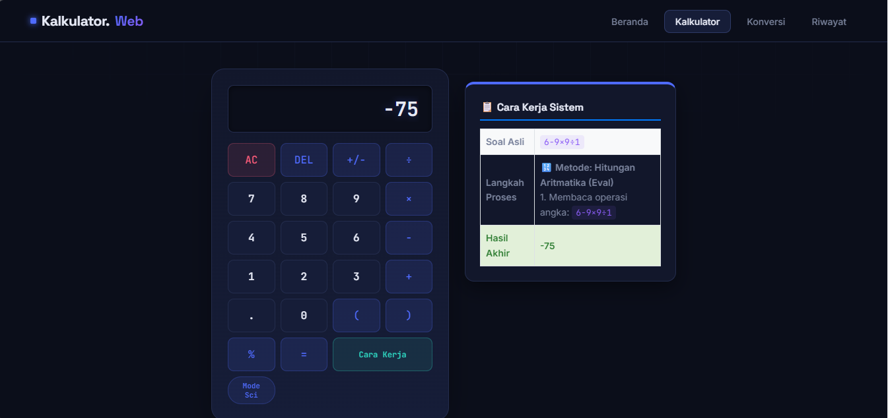
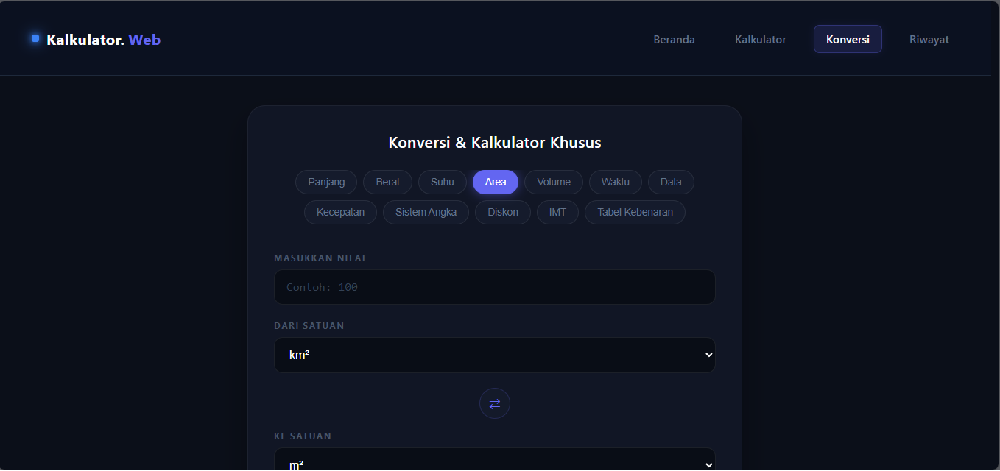
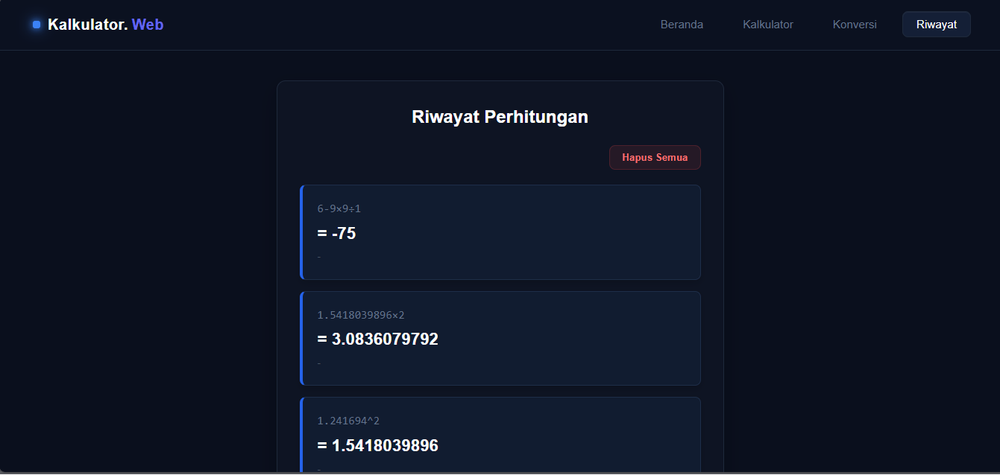

# Kalkulator.Web

A web-based calculator application supporting basic arithmetic operations, unit conversion, and calculation history — built as a team project where I served as Lead Programmer.

## About

Kalkulator.Web is a web-based calculator application developed by a three-member student team as part of an academic project. The application provides basic arithmetic operations, unit conversion, and calculation history to help users perform everyday calculations efficiently.

As the Lead Programmer, I was responsible for leading the technical development of the application. I developed the core calculation logic using JavaScript, contributed to the user interface using HTML and CSS, collaborated with team members throughout development, and ensured the application functioned correctly before the final presentation.

## Features

- Basic arithmetic operations (addition, subtraction, multiplication, division)
- Unit conversion
- Calculation history
- Responsive and user-friendly interface

## Tech Stack

- HTML5
- CSS3
- JavaScript

## My Role — Lead Programmer

- Led the technical development of the application.
- Designed and implemented the core calculation logic using JavaScript.
- Developed and integrated the user interface using HTML5, CSS3, and JavaScript.
- Collaborated with team members to develop and improve application features.
- Performed debugging and testing to ensure the application functioned correctly.
- Participated in the final project presentation by explaining the application's technical implementation.

## How to Run

1. Clone or download this repository.
2. Open `Menu.html` in your web browser.
3. No installation or build steps are required.

## Screenshots

## License

This project is licensed under the MIT License.
